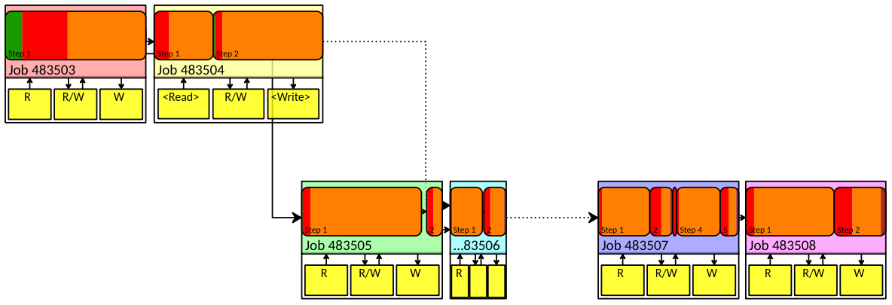

# Workflow Visualizer

The Workflow Visualizer is GUI application for visualizing the high-level JSON summaries created with the `otf2_cli_profile` tool.
The recorded workflow can be visualized as a timeline or as a dependency graph consisting of the recorded Jobs.
Additionally, various summary information like the relative share of job computation time can be displayed for easy identification of bottlenecks.

## Usage

### Opening Files

When started without any arguments, the open-workflow-dialog pops up. 
It consists of a list of files to be opened.
Files can be added by either adding job summary JSON files explicitly or by specifying a folder to be searched for `job_log.json` files.
Files can be added by clicking the `Add Job File` button or by pressing `Alt+A`, which opens a standard file selection dialog.
Folders can be added by clicking the `Add Workflow Folder` button or pressing `Alt+W`.
Files and Folders can also be added by using drag&drop.

The added job summary JSON files are shown in a selectable list.
By default all files which are added are selected.
Only selected files will effectively be loaded.
This can be used to add a file and then deselect jobs which are not to be shown by left-clicking on the shown job file path.

All selected files will be opened for visualizing after clicking the `Show Workflow` button.

Alternatively, the files and folder to be opened can also be specified as command line arguments:

    ./workflow-gui <job_log.json> <workflow folder> ...

### Workflow View

After specifying the list of job summaries (workflow), the main window will be shown.
The menu bar at the top of the main window contains a `File` menu for opening another workflow trace or for closing the currently opened one and a `Help` menu for showing an `About` dialog with the the version number among other information.
The rest of the main window consists of two parts.
The upper part displays the **workflow graph** consisting of jobs, job steps, and accessed files.
The lower part shows summary information about the currently selected item.
By default a summary of the whole workflow is shown.
The worklow summary consists of a runtime share chart grouped by job, a runtime share chart grouped by function group, and a list of further information like the number of job steps, total duration, and inferred file dependencies if I/O there are any.

### Workflow Graph

The workflow graph shows a graphical representation of all jobs and job steps belonging to the loaded workflow.
Each uniquely colored box represents a job and is labeled as `Job <job id>`.
If the job ID is too long to be displayed, the tooltip shown when hovering over the job box with the mouse can be used to display the full-length job ID.

The workflow graph can be zoomed by holding the `Ctrl` key and using the mouse wheel.
The zoom can be reset by pressing `Ctrl+R` or by using the right mouse button to click on the workflow graph, which opens the context menu, and clicking on `Reset Zoom`.

Arrows between jobs represent dependencies.
Solid arrows represent actual job dependencies as read from the JSON summary files.
Dashed arrows represent inferred direct job dependencies based on job start and end times.
For the inference: job A is assumed to be a dependency for job B if 

 - job A is the job with the highest end time still less or equal the start time of job B
 - job B is the job with the smallest start time still greater or equal the end time of job A.

#### Jobs

In the lower part of the job box, are three boxes representing all files accessed by the job in `Read`, `Read/Write`, and `Write` access mode each.
The boxes container either the full list of file paths, shortened file paths, or just the labels `R`, `R/W`, and `W` if even the list of shortened file paths is too long to be displayed.
The full list of files can also be displayed by hovering the mouse over it to show the tooltip or by using the left mouse button to click on it to select it and show detailed information in the information summary in the lower part of the workflow view.

The upper part of the job box contains all job steps which are represented as rounded rectangles with colors representing the share of runtime each function group executed for that job step.
Like the jobs, the job steps are also connected by arrows showing dependencies.
Currently, no job step dependency can be recorded when creating the workflow trace, so only dashed arrows for automatically inferred direct dependencies based on the job start and end times are displayed.

A job step can be zoomed to by double clicking on the job box or by using right mouse click on the job box, which opens the context menu, and clicking on `Zoom to Element`.

As can be seen in the image, in the zoomed version, the files box labels change to a list of files being read and written by the job.

Double clicking on a job or using a single left click on a job box, selects the job and shows a job information summary in the `Job Info` tab below.
The `Job Info` tab shows information such as the job step runtime share, the function group runtime share, and job information like the job ID, dependencies, start time, end time, the number of nodes, CPUs, tasks, and the files sorted by access mode.

#### Job Steps

In the same way as for jobs, a job step can be zoomed to and selected to show specialized information by, e.g., double clicking on a job step box.
For the selected job step, the `Job Step Info` tab will show the runtime share of functions groups in a chart, as well as information like the job step ID, job step name, job step exit code, job step duration, and accessed files.
If [Vampir](https://vampir.eu/) is installed on the system and the vampir binary folder path is in the `PATH` environment variable, the job step's OTF2 trace data can be opened in Vampir by using the right mouse button on the job step to open the context menu and clicking on `Open Trace`.

#### Files

The boxes containing the accessed files per job can also be selected to show dependency information in the `Files Info` tab.

Different columns are displayed depending on what access modes are shown.

 - Read: `Last Modified By`, `Indirectly Modified By`
 - Read/Write: `Last Modified By`, `Indirectly Modified By`, `Next Required By`, `Indirectly Required By`
 - Write: `Next Required By`, `Indirectly Required By`

The `Indirectly Modified By` column shows all jobs which had the file opened for writing earlier in time.
The `Last Modified By` column shows only the last job which opened the file for writing.
The `Indirectly Required By` column shows all jobs which will open the file later in time for reading or writing.
The `Next Required By` column shows the jobs directly requiring the written-to file for reading or writing. 
This column is the inverse of `Last Modified By`.

The job file access modes are a summary of all job step file access belonging to this job.
If one job step writes the file and another job step inside the same job reads the file, then the file will be listed under the `Read/Write` access mode for the whole job.
If a files is only used for reading exclusive or writing in the whole job, then the file is added to the respective access mode for the whole job.

The file dependencies are also displayed as files starting at the edge of one file box and pointing to the edge of another file box.
The file dependency information are not stored in the workflow trace but instead inferred using the job step start and end times.
Therefore, the file dependency arrows are drawn as dashed lines.

#### Display Modes

By default, all job boxes are drawn of equal size and at fixed grid positions.
This is the `Dependency Graph` display mode.

The display mode can be switched by using the right mouse click on the workflow graph to open the context menu, going to the `Set Display Mode` sub menu, and clicking on one of the three modes: `Timeline Mode`, `Dependency Graph`, `Duration-Scaled Dependency Graph`.
The `Duration-Scaled Dependency Graph` shows the job / job step boxes with widths which are proportional to the job / job step duration but the positions of the boxes are still chosen similarly to the `Dependency Graph` as a fixed size horizontal gap.
This allows for visualizing of the job duration while still keeping enough space for the dependency arrows to be drawn without overlap.

In the `Timeline Mode`, the job / job step box widths and the job / job step box position are chosen based on the job start and end times and therefore represents the workflow as a timeline with the horizontal axis being proportional to time.
Jobs which would overlap are still drawn in different rows to avoid overlap.

